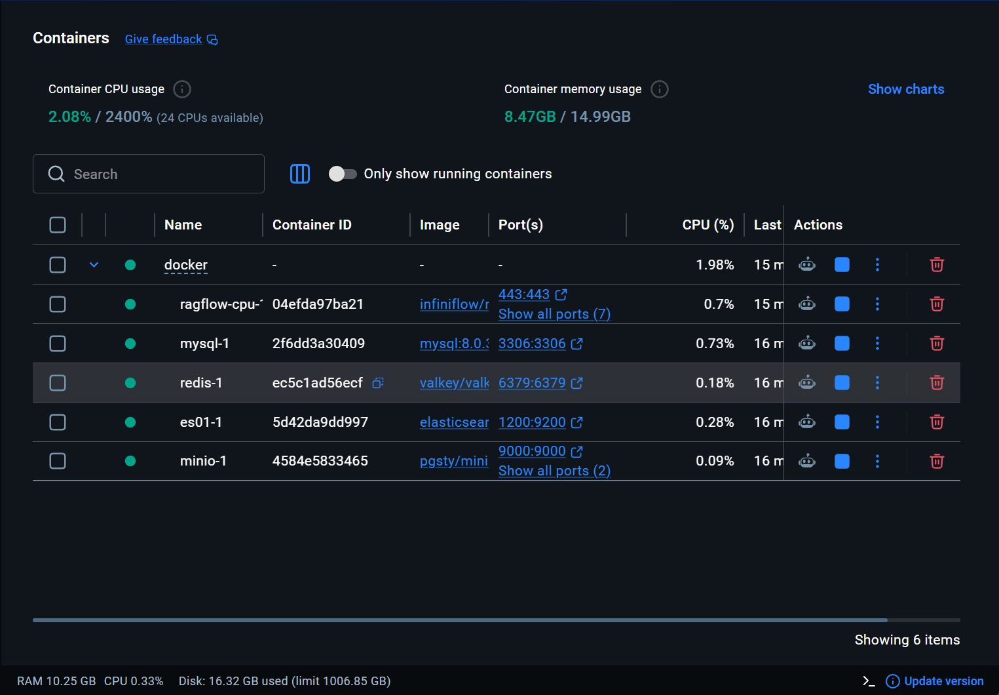
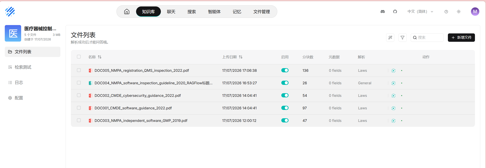
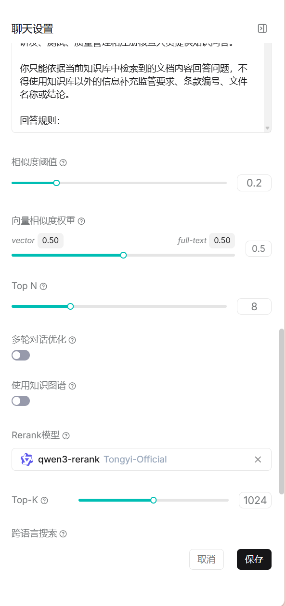
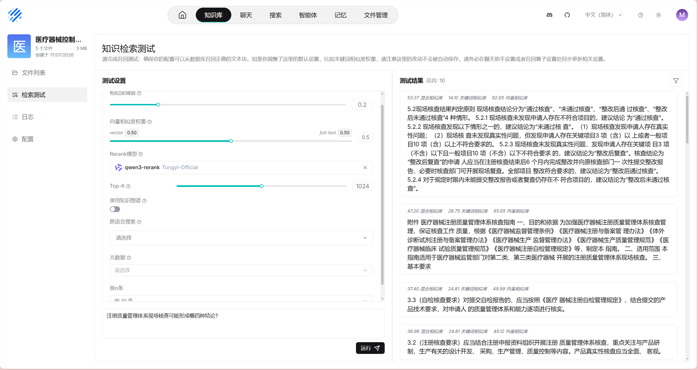
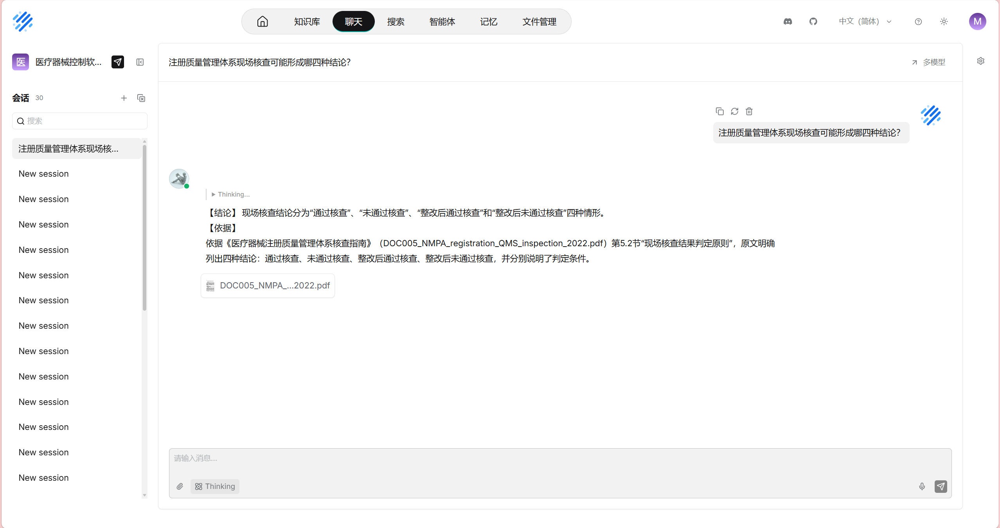
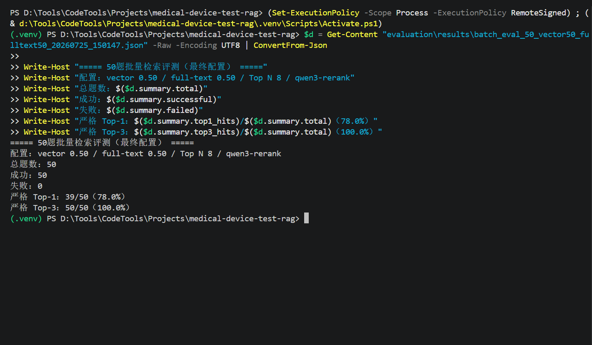
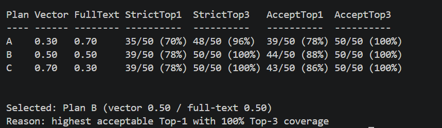

# Medical Device Software Testing RAG Workbench

基于 RAGFlow 构建的医疗器械控制软件测试知识库与检索增强问答工作台。项目围绕医疗器械软件注册审查、网络安全、生产质量管理和现场检查等公开资料，提供带来源引用的专业问答与可复现评测流程。

## 项目目标

- 建设医疗器械软件测试领域的结构化知识库。
- 对官方 PDF、Markdown 文档进行解析、切片、向量化和混合检索。
- 通过 Rerank 与领域提示词生成可核查、带引用的回答。
- 建立人工基线、批量检索评测和 LLM 自动裁判流程。
- 量化 Top-1、Top-3、引用正确率、回答准确度和幻觉率。

## 主要功能

- 医疗器械软件测试文档知识库
- PDF 与 Markdown 文档解析和知识切片
- 向量检索与全文关键词混合检索
- Rerank 检索结果重排序
- 带来源编号和原文片段的 RAG 问答
- 50 道人工基线、30 道回归、100 道官方扩充和 24 道实践层题集
- 覆盖 30 个 RAGFlow 文件条目的 204 道全语料回归评测
- RAGFlow API 批量问答与引用采集
- 严格文档命中与可接受等价文档命中评估
- 基于实际引用证据的 LLM 自动裁判
- 自动结果与人工基线对比及争议题复核
- 法规、测试设计、评测三个专业 Agent 与可解释意图路由
- 低置信度查询改写、引用质量门禁和一次受控重试
- 30 道 Agent 路由/工具调用评测与统一质量、延迟、成本指标
- Prometheus 指标、OpenTelemetry Trace 与 Jaeger 链路分析
- LangChain + Docling 批量解析、SHA-256增量去重与SQLite断点续跑

## 技术方案

- RAGFlow v0.26.4
- Docker Desktop、Docker Compose、WSL 2、Ubuntu
- Elasticsearch、MySQL、Redis、MinIO
- Python 3.14
- Requests、python-dotenv、openpyxl
- LangChain Text Splitters、Docling、SQLite、ProcessPool
- 混合检索：向量权重 0.50、全文权重 0.50
- Rerank：qwen3-rerank
- LLM API 与独立评测裁判助手
- Git / GitHub

## 评测设计

项目最终采用四组互补题集：

- **人工基线回归集**：50 道问题，覆盖 DOC001-DOC005，用于建立人工基线、分析失败案例和校准自动裁判。
- **原独立留出回归集**：30 道问题，覆盖 DOC001-DOC005。首次测试时未参与调参；测试完成并用于分析后，按规范转为回归集。
- **官方扩充回归集**：100 道问题，覆盖 DOC006-DOC013、DOC015 和 DOC016。
- **实践层覆盖回归集**：24 道问题，每份 PRACTICE 文档 3 道，同时评估逻辑文档和精确文件名命中。

每道题记录：

- 预期文档和章节定位
- 人工标准答案要点
- 实际回答与引用片段
- Top-1、Top-3 文档命中
- 引用正确性
- 回答准确度（0—2）
- 是否出现幻觉

为避免多轮上下文干扰，批量评测时每道题使用独立会话。自动裁判只接收用户问题、人工标准答案、待评测回答和回答实际引用的证据，不连接知识库，也不使用外部知识补充判断。

## v1.1 分层知识扩充（已完成）

v1.1 将文档来源划分为三个可区分的知识层：

- **中国官方监管与标准层**：DOC001-DOC008、DOC012、DOC013、DOC015 和 DOC016。覆盖注册审查、网络安全、质量体系、可用性、移动医疗器械、产品技术要求、软件生命周期、风险管理、不良事件和召回。
- **国际对照层**：DOC009-DOC011。收录 FDA 软件上市前资料、网络安全和 OTS 软件最终指南，仅用于美国监管语境和国际比较。
- **项目原创实践层**：PRACTICE001-PRACTICE008。补充测试策略、风险测试、权限与审计、故障恢复、安装升级、性能稳定性、回归测试及缺陷证据方法。

DOC014（GB/T 38634 软件测试系列）因现有转录不完整，已从活动知识库和当前评测范围中删除。原创实践层是工程方法，不属于法规或标准；FDA 文件也不得表述为中国监管要求。完整目录、地域标签、来源和完整性校验信息见 `data/catalog`，入库与回归方案见 `docs/v1.1_document_expansion.md`。

独立留出测试在运行前冻结题目、标准答案和检索参数，首轮结果保留不覆盖。H005 首轮因外部 Embedding API 出现临时 SSL 连接错误而失败，随后在相同配置下单题重试成功，并通过合并脚本形成最终 30 题结果。留出测试的主要检索指标采用严格文档命中，不在测试完成后追加等价文档规则。

## 当前评测结果

最终全语料回归覆盖 30 个 RAGFlow 文件条目、23 个逻辑来源和 204 道问题。冻结配置为相似度阈值 `0.20`、向量/全文权重 `0.50/0.50`、Top N `8`、Top-K `128`、`qwen3-rerank`，关闭跨语言搜索。

| 指标 | 结果 |
|---|---:|
| 批量调用成功率 | 100%（204/204） |
| 严格检索 Top-1 | 87.3%（178/204） |
| 严格检索 Top-3 | 95.1%（194/204） |
| 自动裁判引用正确率 | 99.5%（203/204） |
| 自动裁判回答准确度 | 93.6%（382/408） |
| 自动裁判幻觉率 | 1.0%（2/204） |
| 人工复核引用正确率 | 100%（204/204） |
| 人工复核回答准确度 | 94.4%（385/408） |
| 人工复核幻觉率 | 0%（0/204） |

严格文档命中率低于引用正确率的主要原因是 DOC003 与 DOC004 等来源存在语义相同的对应条款。项目同时保留严格来源指标、精确文件名指标、自动裁判原始结果和人工争议复核，不以修改题目或注入标准答案的方式追求满分。完整总报告见 `evaluation/reviews/full_corpus_regression_evaluation_20260805.md`。

权重对比实验测试了 `0.30/0.70`、`0.50/0.50` 和 `0.70/0.30` 三组向量/全文权重。最终选择 `0.50/0.50`：相比原基线，严格 Top-1 从 70% 提升到 78%，严格 Top-3 从 96% 提升到 100%，同时取得最高的可接受 Top-1。完整实验记录见 `evaluation/reviews/retrieval_parameter_experiment_20260725.md`。

### 100 题官方扩充评测

在新增中国监管资料、FDA 对照资料、YY/T 0664—2020 和 GB/T 42062—2022 后，项目建立并冻结了 100 道官方扩充题集。最终配置保持相似度阈值 `0.20`、向量/全文权重 `0.50/0.50`、Top N `8`、Top-K `128` 和 `qwen3-rerank`。针对长切片、跨语言问法和多文档竞争问题，仅使用可核验原文建立聚焦切片，并保留修改前快照。

最终检索批次：`batch_eval_100_official_expansion_v1_topk128_qwen_repaired_final_20260804_143221`

| 指标 | 结果 |
|---|---:|
| 批量调用成功率 | 100%（100/100） |
| 严格检索 Top-1 | 88%（88/100） |
| 严格检索 Top-3 | 92%（92/100） |
| 自动裁判引用正确率 | 99%（99/100） |
| 自动裁判回答准确度 | 91.5%（183/200） |
| 自动裁判幻觉率 | 1%（1/100） |

人工复核保留了两项裁判边界说明：E053 的自动裁判使用“维护方案通常包含……”进行证据外推断；E090 增加的监管机构处理时限有实际引文支持，但偏离问题主体，更适合计入回答准确度而非幻觉。按既定裁判规则复核后，引用正确率为 100%，回答准确度仍为 91.5%，幻觉率为 0%。项目同时保留自动原始指标和人工复核口径，不以修改题目或注入标准答案的方式追求满分。

完整过程和结果文件见 `evaluation/reviews/official_expansion_final_evaluation_20260804.md`。

### 原独立留出集回归结果

最终配置固定为相似度阈值 `0.20`、向量/全文权重 `0.50/0.50`、Top N `8`、Rerank 模型 `qwen3-rerank`。

| 指标 | 结果 |
|---|---:|
| 批量调用成功率 | 100%（30/30） |
| 严格检索 Top-1 | 90.0%（27/30） |
| 严格检索 Top-3 | 96.7%（29/30） |
| 自动裁判引用正确率 | 100%（30/30） |
| 自动裁判回答准确度 | 96.7%（58/60） |
| 自动裁判幻觉率 | 0%（0/30） |
| 人工复核回答准确度 | 98.3%（59/60） |

该题集首次运行时是未参与前期调参的独立留出集；由于结果随后被用于系统分析，现在按回归集管理。人工复核发现 H018 的裁判理由明确认定核心要点完整，却仍输出准确度 `1`，因此修正为 `2`；H021 对软件设计检查内容存在真实遗漏，保留准确度 `1`。

冻结题集与正式结果分别保存在：

- `evaluation/holdout/医疗器械软件测试知识库_独立留出测试工作簿_v1.xlsx`
- `evaluation/holdout/results/医疗器械软件测试知识库_独立留出测试结果_v1.xlsx`

### 项目原创实践层评测

实践层题集覆盖 PRACTICE001-PRACTICE008，每份文档 3 题，共 24 题。该题集用于工程实践内容的覆盖回归，不作为监管合规或独立泛化能力证明。

| 指标 | 结果 |
|---|---:|
| 批量调用成功率 | 100%（24/24） |
| 逻辑文档 Top-1 / Top-3 | 100%（24/24） |
| 精确文件 Top-1 / Top-3 | 100%（24/24） |
| 自动裁判引用正确率 | 100%（24/24） |
| 自动裁判回答准确度 | 93.8%（45/48） |
| 自动裁判幻觉率 | 0%（0/24） |

P017、P021 和 P024 存在真实要点遗漏，因此不进行人工提分。题集与说明见 `evaluation/practice/`。

## 系统展示

### Docker运行环境



### 知识库建设



### 最终检索配置



### 检索与引用问答





### 评测结果





## 快速使用

创建 `.env` 并参考 `.env.example` 填写本地 RAGFlow 地址、API Key、问答助手名称和裁判助手名称。真实 `.env` 不应提交到 Git。

验证 RAGFlow API 连接：

```powershell
python scripts/check_connection.py
```

运行 50 道批量问答：

```powershell
python scripts/run_batch_eval.py --limit 50
```

运行原独立留出回归集：

```powershell
python scripts/run_batch_eval.py --limit 30 --workbook "evaluation\holdout\医疗器械软件测试知识库_独立留出测试工作簿_v1.xlsx" --label holdout_v1_frozen
```

运行 100 道官方扩充题和 24 道实践层题：

```powershell
python scripts/run_batch_eval.py --limit 100 --workbook "evaluation\expansion\医疗器械软件测试知识库_官方扩充评测工作簿_v1.xlsx" --label official_expansion_v1
python scripts/run_batch_eval.py --limit 24 --workbook "evaluation\practice\practice_documents_evaluation_v1.json" --label practice_documents_v1_full
```

若某道题仅因临时接口错误失败，可在相同配置下按问题 ID 重试，再合并结果：

```powershell
python scripts/run_batch_eval.py --limit 1 --question-id H005 --workbook "evaluation\holdout\医疗器械软件测试知识库_独立留出测试工作簿_v1.xlsx" --label holdout_v1_retry_h005
python scripts/merge_eval_retry.py --base "首轮JSON" --retry "重试JSON" --label holdout_v1_frozen_merged
```

计算检索和引用命中：

```powershell
python scripts/score_acceptable_hits.py
python scripts/score_citation_hits.py
```

运行 50 道自动裁判：

```powershell
python scripts/run_judge_eval.py --limit 50
```

比较自动裁判与人工基线：

```powershell
python scripts/compare_judge_baseline.py
```

比较两个检索参数实验：

```powershell
python scripts/compare_retrieval_experiments.py --baseline "基线JSON" --candidate "候选JSON"
```

生成的 JSON 和 CSV 保存在 `evaluation/results`，该目录中的运行结果默认不提交到 Git。

完整的Windows、WSL 2和Docker Desktop部署步骤见：[RAGFlow本地部署与项目运行说明](docs/deployment.md)。

## FastAPI Agent 服务（v1.3）

项目提供独立的 API 服务层，便于接入前端、Agent 和外部测试工具。接口包含 RAGFlow 健康检查、结构化问答、SSE 阶段事件流和证据核查 Agent。证据核查 Agent 通过工具链调用知识库问答和引用编号核验，并返回可观察的工具执行轨迹；当前 SSE 返回检索状态、完整答案和完成事件，后续可继续升级为模型 Token 级流式输出。

安装开发依赖并启动：

```powershell
python -m pip install -r requirements.txt -r requirements-dev.txt
python -m uvicorn app.main:app --host 127.0.0.1 --port 8000 --reload
```

启动后访问 `http://127.0.0.1:8000/docs` 查看交互式接口文档，或调用：

```text
GET  /health
GET  /metrics
POST /api/v1/ask
POST /api/v1/ask/stream
POST /api/v1/agent/review
POST /api/v1/agents/regulatory
POST /api/v1/agents/test-design
POST /api/v1/agents/evaluation
POST /api/v1/agents/route
POST /api/v1/agents/workflow
POST /api/v1/chat
GET  /api/v1/conversations/{conversation_id}
DELETE /api/v1/conversations/{conversation_id}
POST /api/v1/evaluations/run
GET  /api/v1/evaluations/{job_id}
GET  /api/v1/evaluations/{job_id}/result
```

`/metrics` 以 Prometheus 文本格式暴露 HTTP 请求量与延迟、RAGFlow
调用结果与延迟、Agent 路由置信度、各 Agent 成功率与延迟、工具调用、
启发式 Token/成本估算、Redis 会话操作和异步评测任务状态。
服务日志采用单行 JSON，包含请求 ID、路由、状态码和耗时；不记录问题
正文、回答正文、API Key 或 Redis 密码。调用方也可传入 `X-Request-ID`
用于跨服务追踪。

### Nginx + Docker Compose 统一部署

根目录 `.env` 配置好 RAGFlow 与 Redis 密码后运行：

```powershell
docker compose -f deploy/docker-compose.agent.yml up -d --build
```

部署后可访问：

- `http://localhost:8080/docs`：经 Nginx 代理的 FastAPI 文档；
- `http://localhost:8080/metrics`：Prometheus 文本指标；
- `http://localhost:9090`：Prometheus 查询界面。
- `http://localhost:16686`：Jaeger Trace 查询界面；
- `http://localhost:8080/mcp`：MCP Streamable HTTP 工具入口。

该 Compose 栈只新增 Agent API、专用 Redis、Nginx 和 Prometheus，
不会重建或删除已有 RAGFlow 数据。容器内 API 通过
`host.docker.internal:9380` 访问宿主机上的 RAGFlow；如端口不同，可在
`.env` 中设置 `AGENT_RAGFLOW_BASE_URL`。SSE 路由已关闭 Nginx 缓冲。

MCP 服务向可信客户端提供法规问答、测试设计、证据核查、意图路由、
受控多步工作流、登记题集评测启动和评测状态查询七个工具。设计与安全
边界见 [Agent 工作台增强说明](docs/agent_workbench_v1.2.md)，v1.3 的
评测与追踪设计见 [Agent 评测与全链路追踪](docs/agent_evaluation_v1.3.md)。

运行 3 道 Agent 冒烟评测或完整 30 道冻结评测：

```powershell
python scripts/run_agent_eval.py --limit 3 --label agent_v1_smoke
python scripts/run_agent_eval.py --limit 30 --label agent_v1_frozen
```

冻结集最终合并结果：30/30请求成功，三个Agent各10题，端到端路由准确率
100%、必需工具召回率100%、任务完成率96.7%，p95延迟56.2秒。首次运行
因30秒RAGFlow超时产生的16个502被单独保留和补测，没有覆盖原始结果。

运行接口测试：

```powershell
python -m pytest
python scripts/configure_redis_memory.py
python scripts/check_memory.py
python scripts/check_mcp.py
```

### 批量文档摄取

离线摄取管线按清单发现文档，使用SHA-256跳过未变化文件，以SQLite保存
任务状态和失败信息，通过有限ProcessPool调用Docling完成PDF/DOCX结构化，
再使用LangChain按Markdown标题及中文标点递归切片。默认只生成结构化Markdown、
JSONL切片和质量报告；确认后才通过RAGFlow API上传、解析和索引。

```powershell
python -m pip install -r requirements-ingestion.txt

python scripts/ingest_batch_documents.py `
  --manifest "config/document_ingestion_manifest.json" `
  --workers 2

python scripts/ingest_batch_documents.py `
  --manifest "config/document_ingestion_manifest.json" `
  --apply `
  --dataset-name "医疗器械控制软件测试知识库" `
  --workers 2 `
  --ragflow-workers 2 `
  --metrics-port 9108
```

完整的清单字段、安全边界、恢复方式和指标说明见
[批量文档摄取说明](docs/batch_document_ingestion.md)。

## 项目结构

```text
medical-device-test-rag/
├── app/                # FastAPI 服务层与数据模型
├── evaluation/
│   ├── baseline/        # 人工评测工作簿
│   ├── agent/           # 30 道 Agent 路由与工具调用冻结题集
│   ├── config/          # 可接受等价文档配置
│   ├── expansion/       # 100 道官方扩充题集
│   ├── holdout/         # 原独立留出集，现作为回归集
│   ├── practice/        # 24 道项目原创实践层题集
│   ├── reviews/         # 争议题人工复核记录
│   └── results/         # 本地批量运行结果
├── scripts/
│   ├── check_connection.py
│   ├── ingest_single_document.py
│   ├── ingest_batch_documents.py
│   ├── ragflow_client.py
│   ├── run_batch_eval.py
│   ├── run_agent_eval.py
│   ├── merge_agent_eval_retry.py
│   ├── merge_eval_retry.py
│   ├── score_acceptable_hits.py
│   ├── score_citation_hits.py
│   ├── test_judge.py
│   ├── run_judge_eval.py
│   ├── compare_judge_baseline.py
│   └── compare_retrieval_experiments.py
├── tests/              # API 单元测试（不调用真实模型）
├── .env.example
├── .gitignore
├── requirements.txt
├── requirements-ingestion.txt
└── README.md
```

## 当前进度

- [x] 安装并配置 WSL 2、Ubuntu、Git 和 Docker Desktop
- [x] 部署并验证 RAGFlow v0.26.4
- [x] 配置聊天、Embedding 和 Rerank 模型
- [x] 收集、分类并解析医疗器械软件官方公开资料
- [x] 创建领域知识库和问答助手
- [x] 建立 50 道人工基线评测题集
- [x] 编写 RAGFlow API 客户端和批量评测脚本
- [x] 实现严格命中、等价文档命中和引用命中评估
- [x] 创建并校准 LLM 自动裁判
- [x] 完成自动裁判与人工基线对比及争议题复核
- [x] 完成检索参数对比实验并确定最终权重
- [x] 建立并冻结 30 道独立留出测试题集
- [x] 完成独立留出测试、失败重试归档和自动裁判评测
- [x] 整理系统截图和典型问答案例
- [x] 完善部署说明、演示材料
- [x] 完成 v1.1 中国官方、FDA 对照和项目原创实践文档的本地准备
- [x] 完成 v1.1 新文档逐份入库与切片验收
- [x] 冻结并运行 100 道官方扩充题集
- [x] 建立并运行 24 道项目原创实践层题集
- [x] 完成覆盖 30 个文件条目的 204 道全语料回归评测
- [x] 整理 v1.1 最终提交并发布 GitHub Release
- [x] 增加 FastAPI 健康检查、结构化问答与 SSE 事件流接口
- [x] 增加基于工具调用的证据核查 Agent
- [x] 增加法规、测试设计和评测三个专业 Agent
- [x] 增加可解释意图识别与专业 Agent 自动路由
- [x] 增加 Redis 多轮会话记忆、历史查询和会话清理接口
- [x] 将批量评测脚本封装为异步评测 API 和任务状态接口
- [x] 增加 Prometheus 指标、请求 ID 和隐私安全的 JSON 结构化日志
- [x] 增加 Nginx、Prometheus、Redis 与 FastAPI 的 Docker Compose 部署
- [x] 增加基于 Streamable HTTP 的 MCP 领域工具服务
- [x] 建立 30 道 Agent 路由与工具调用冻结评测集
- [x] 统一路由、工具、证据、任务、延迟和估算成本指标
- [x] 接入 OpenTelemetry + Jaeger 全链路追踪
- [x] 增加低置信度查询改写与引用质量门禁多步工作流
- [x] 增加LangChain、Docling、SQLite和SHA-256驱动的批量摄取管线

## 许可与资料声明

本仓库中的原创代码、评测脚本、配置示例和项目文档采用 [MIT License](LICENSE) 发布。

RAGFlow及其他第三方软件、模型和依赖仍遵循各自的上游许可证，本仓库不对其版权或商标作出重新授权。

项目使用的医疗器械监管资料来自公开渠道，资料目录与来源记录见 `data/catalog/document_catalog.csv`。相关原始文件的版权、解释权和更新权归各发布机构所有，本仓库不对监管原文进行重新授权。

本项目仅用于技术研究、软件测试知识管理和RAG效果评估，不构成医疗、法律或监管合规建议。实际使用时应以监管机构发布的最新正式文件为准。
